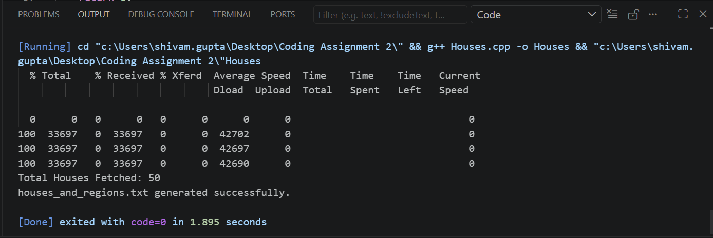
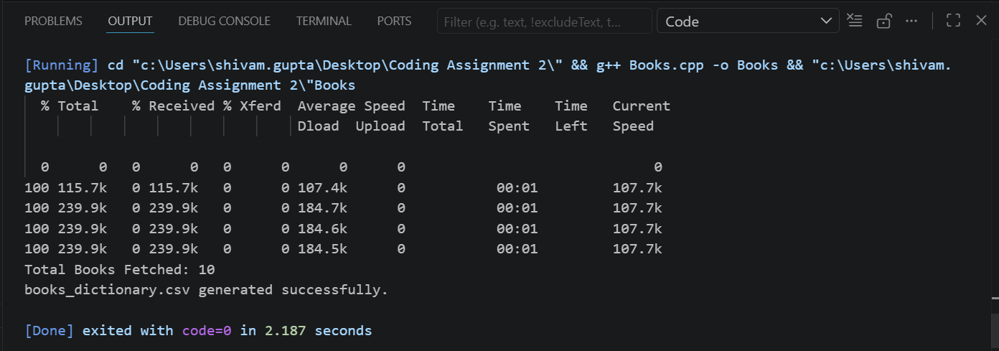
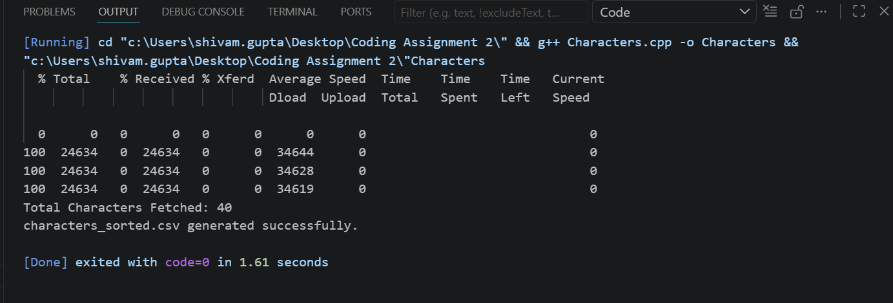

# Assignment 2 - Ice and Fire API Integration using C++

## Q1 - Houses of Ice and Fire
- Fetch houses data using API
- Sort alphabetically
- Save into TXT file

### Output

---

## Q2 - Books of Ice and Fire
- Fetch books data using API
- Create dictionary
- Export CSV file

### Output

---

## Q3 - Characters of Ice and Fire
- Fetch character data
- Count season appearances
- Sort data
- Export CSV file

### Output

